# 📊 Diagrammi del Sistema LoanTech Solutions

## Indice
- [Diagramma delle Classi UML](#diagramma-delle-classi-uml)
- [Diagramma Entità-Relazioni](#diagramma-entità-relazioni-er)
- [Architettura del Sistema](#architettura-del-sistema)
- [Diagramma dei Casi d'Uso](#diagramma-dei-casi-duso)
- [Sequence Diagrams](#sequence-diagrams)

---

## Diagramma delle Classi UML

### Overview
Il diagramma delle classi rappresenta la struttura object-oriented del sistema, evidenziando le entità del dominio e le loro relazioni.

```mermaid
classDiagram
    class User {
        -Long userId
        -String email
        -String passwordHash
        -String firstName
        -String lastName
        -String fiscalCode
        -String phoneNumber
        -LocalDate dateOfBirth
        -LocalDateTime createdAt
        +register(RegisterRequest) User
        +login(LoginRequest) boolean
        +updateProfile(UserUpdateRequest) void
        +getLoanApplications() List~LoanApplication~
        +getCreditScore() CreditScore
    }
    
    class LoanApplication {
        -Long applicationId
        -Long userId
        -LoanType loanType
        -BigDecimal requestedAmount
        -Integer durationMonths
        -BigDecimal monthlyIncome
        -String employmentStatus
        -ApplicationStatus status
        -LocalDateTime submittedAt
        -LocalDateTime processedAt
        +submitApplication() void
        +updateStatus(ApplicationStatus) void
        +calculateMonthlyPayment(BigDecimal) BigDecimal
        +approve() Loan
        +reject() void
    }
    
    class Loan {
        -Long loanId
        -Long applicationId
        -Long userId
        -BigDecimal principalAmount
        -BigDecimal interestRate
        -Integer durationMonths
        -BigDecimal monthlyPayment
        -BigDecimal remainingBalance
        -LocalDate startDate
        -LocalDate endDate
        -LoanStatus status
        +makePayment(BigDecimal) Payment
        +calculateAmortization() List~AmortizationEntry~
        +getPaymentHistory() List~Payment~
        +checkOverduePayments() List~Payment~
    }
    
    class Payment {
        -Long paymentId
        -Long loanId
        -BigDecimal amount
        -BigDecimal principalPaid
        -BigDecimal interestPaid
        -BigDecimal remainingBalance
        -LocalDate paymentDate
        -LocalDate dueDate
        -PaymentStatus status
        +processPayment() void
        +markAsOverdue() void
        +calculateLateFee() BigDecimal
        +reversePayment() void
    }
    
    class Document {
        -Long documentId
        -Long applicationId
        -String documentType
        -String fileName
        -String filePath
        -Boolean verified
        -LocalDateTime uploadedAt
        +uploadDocument(MultipartFile) void
        +verifyDocument() void
        +deleteDocument() void
        +downloadDocument() byte[]
    }
    
    class CreditScore {
        -Long scoreId
        -Long userId
        -Integer score
        -String riskCategory
        -LocalDateTime calculatedAt
        +calculateScore() Integer
        +updateScore(Integer) void
        +getRiskAssessment() String
        +getScoreHistory() List~CreditScore~
    }
    
    User ||--o{ LoanApplication : "submits"
    LoanApplication ||--o| Loan : "becomes"
    Loan ||--o{ Payment : "has"
    LoanApplication ||--o{ Document : "requires"
    User ||--o| CreditScore : "has"
```

### Relazioni Principali
- **User ↔ LoanApplication**: Un utente può avere multiple richieste prestito
- **LoanApplication ↔ Loan**: Una richiesta approvata diventa un prestito
- **Loan ↔ Payment**: Un prestito ha multiple rate di pagamento
- **User ↔ CreditScore**: Ogni utente ha un credit score

---

## Diagramma Entità-Relazioni (ER)

### Overview
Il modello dati relazionale ottimizzato per performance e integrità referenziale.


### Vincoli di Integrità
- **Primary Keys**: Auto-incrementali per tutte le tabelle
- **Foreign Keys**: Constraint di integrità referenziale
- **Unique Constraints**: Email e codice fiscale unici
- **Check Constraints**: Validazione range per importi e score

---

## Architettura del Sistema

### Layered Architecture

```mermaid
graph TB
    subgraph "🎨 Presentation Layer"
        A[React Components]
        B[React Router]
        C[State Management]
        D[CSS Responsive]
    end
    
    subgraph "🌐 API Gateway Layer"
        E[Spring Controllers]
        F[Security Filters]
        G[CORS Config]
        H[Error Handlers]
    end
    
    subgraph "💼 Business Logic Layer"
        I[UserService]
        J[LoanApplicationService]
        K[LoanService]
        L[PaymentService]
    end
    
    subgraph "🔍 Data Access Layer"
        M[JPA Repositories]
        N[Entity Managers]
        O[Transaction Managers]
    end
    
    subgraph "🗄️ Database Layer"
        P[(H2 Database)]
        Q[(PostgreSQL)]
    end
    
    A --> E
    B --> E
    C --> E
    D --> E
    E --> I
    E --> J
    E --> K
    E --> L
    I --> M
    J --> M
    K --> M
    L --> M
    M --> P
    M --> Q
    N --> P
    N --> Q
    O --> P
    O --> Q
```



---

## Diagramma dei Casi d'Uso


---

## Sequence Diagrams

### Processo Richiesta Prestito


### Processo Pagamento


---

## Note Tecniche

### Convenzioni di Naming
- **Classi**: PascalCase (es. `LoanApplication`)
- **Metodi**: camelCase (es. `calculateMonthlyPayment`)
- **Tabelle**: snake_case (es. `loan_applications`)
- **Colonne**: snake_case (es. `user_id`)

### Pattern Implementati
- **Repository Pattern**: Data access abstraction
- **DTO Pattern**: Data transfer objects
- **Builder Pattern**: Object construction
- **Strategy Pattern**: Different loan types
- **Observer Pattern**: Status change notifications